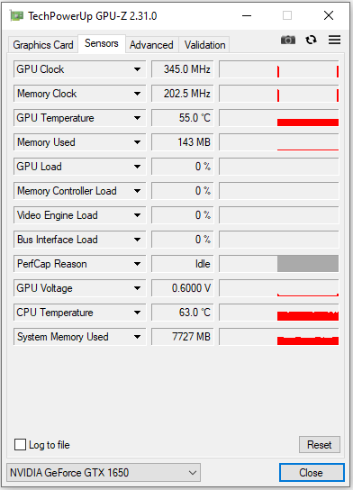
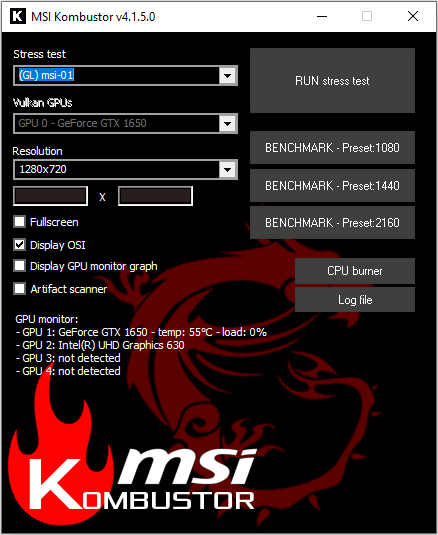

# Benchmarking with GPU-Z and MSI Kombustor

First you need to start up GPU - Z and click the sensors tab. Here you should see the GPU Clock and other useful stats about your computer's GPU. 

Now start up MSI Kombustor and set the resolution to 1080p. Check the fullscreen box and hit "RUN stress test". This should start up a fullscreen window where a stress test starts.

As the test runs, make sure the voltage isn’t going above .700v anytime during the test. Watch and see if the GPU temps stay under 75 degrees and the artifacts found stay at 0.

If the voltage isn’t staying at .700c then you didn’t do something right in Afterburner. If Kombustor is finding artifacts then your clock speed is too high for the voltage you’re running at and it needs to be lowered a bit across the entire curve.

