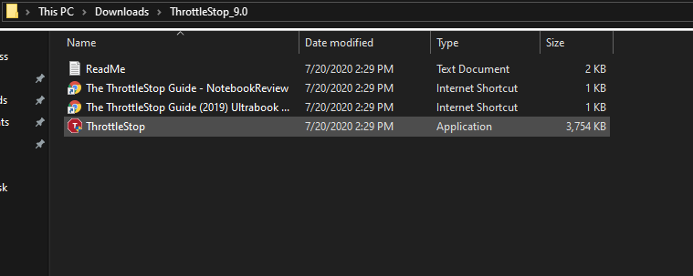
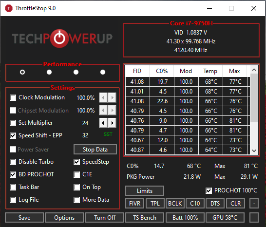
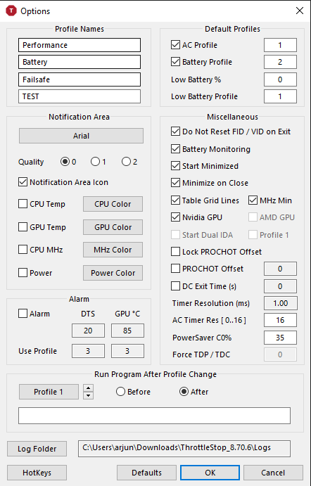

# Configuring ThrottleStop

## Installing ThrottleStop

To install ThrottleStop, click [here](https://www.techpowerup.com/download/techpowerup-throttlestop/). At the time of writing, the latest version is 9.0, however you should download the most recent version for any bug fixes/new features. 

Once you have downloaded the ThrottleStop zip file, unzip it using your preferred unzipping tool. Then open the folder to take a look at what is inside. You should see 4 files: a readme, 2 guides for ThrottleStop, and a ThrottleStop Application.

Look through the readme if you want to see any new changes to ThrottleStop. When you are ready to undervolt, double click on the ThrottleStop application. You should get a disclaimer saying ThrottleStop can cause damage to your CPU, read it and then click OK.

Now the ThrottleStop main window should pop up. It looks complex but it is pretty easy to use once you get the hang of it.

The part of ThrottleStop that you will be using the most is the button labeled FIVR under Limits. FIVR stands for Fully Integrated Voltage Regulator.

Before we start undervolting, we need to configure some options. Click on Options in the bottom left corner.

First lets take a look at the profiles. First you should set a profile for AC and one for battery power. This ensures that while you are plugged in you can have the best performance, and while you are on the go, you won't have to sacrifice battery life. You can even set a battery percent threshold that will switch the computer to another low battery specific profile \(I personally don't use one\). Apart from your battery and AC profiles, you should set a Failsafe profile. This just switches the undervolt off if your computer gets too hot. Go the the Alarm section, tick the box and set the profile number that corresponds with your failsafe profile. DTS is the number of degrees away from the max temperature your system can handle, I usually set mine to 20. the GPU temp is the literal temp of the GPU, so I set mine to 85. Next, if you have a dedicated GPU, select Nvidia or AMD in the Miscellaneous box. Then just hit OK and return to the main ThrottleStop window and click on FIVR.

