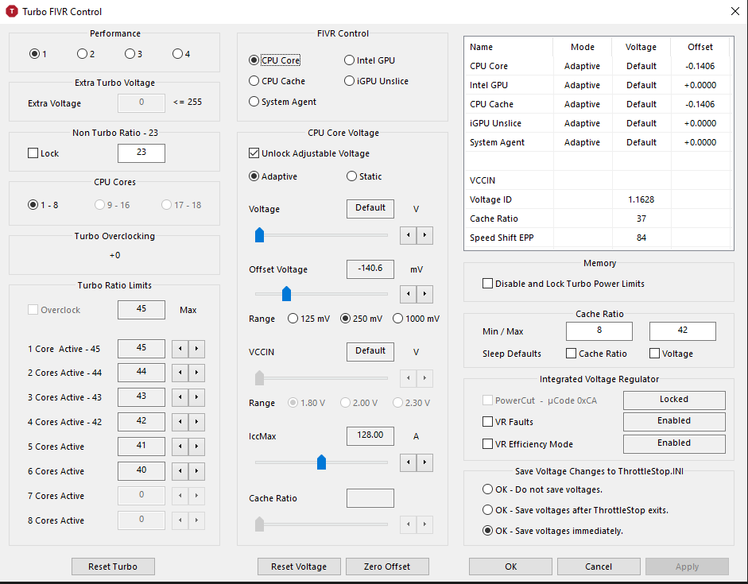

# Undervolting

Open up the Turbo FIVR Control page by clicking on FIVR in the ThrottleStop window.

The section labeled CPU core voltage is what we will be tweaking to undervolt our CPU. THe box above, labeled FIVR control, determines what we actually undervolt. To undervolt our CPU, we need to change CPU Core and CPU Cache. If you do not have an dedicated GPU, you may need to undervolt your Intel GPU as well, however many people say that it doesn't make much of a difference. If you are in doubt, don't undervolt your Intel GPU.

 To start off, make sure the button for CPU Core is selected. Also make sure "Adaptive" under "Unlock Adjustable Voltage" is selected. Assuming you have a newer CPU, we can start out with a -80mv undervolt. Move the Offset voltage slider so that it says -80 in the box next to mV. Next, make sure your CPU cache is set to the same value. The CPU cache should almost always be the same value as your CPU Core. Once you have made sure that CPU Core and CPU Cache are the same, press Apply. If your computer doesn't crash immediately, press OK, Save voltages immediately. Look at the table in the top right of the screen to make sure your offset values are right. If they aren't, your CPU is not undervolted. Make sure of this before you start benchmarking your computer.

