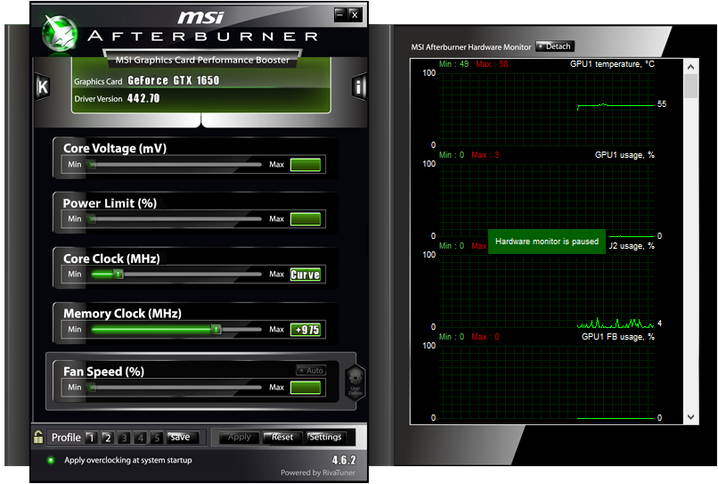
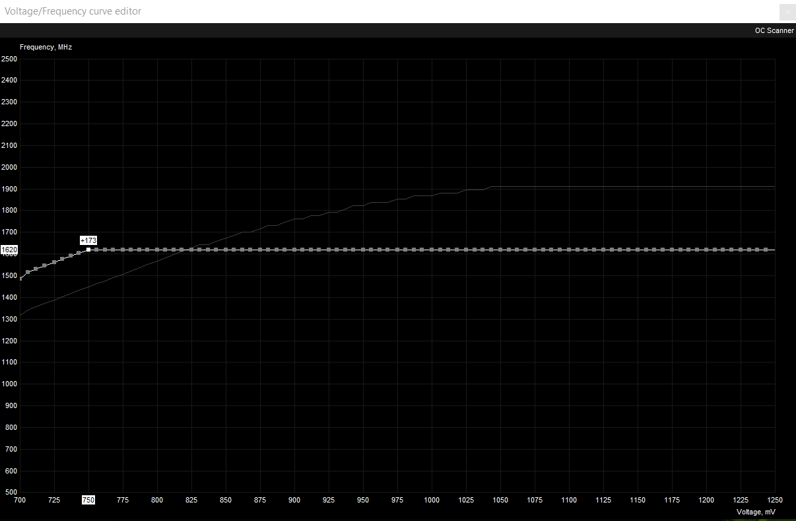

# Undervolting with MSI Afterburner

There are 3 tools that you will need to undervolt your GPU. [GPU-Z](https://www.techpowerup.com/download/techpowerup-gpu-z/), [MSI Kombustor](https://geeks3d.com/furmark/kombustor/downloads/), and [MSI Afterburner](https://www.msi.com/page/afterburner).

After installing these three, you will first want to open up MSI Afterburner. 

First you will want to press Ctrl + F on your keyboard. That should bring up a graph window labeled Voltage/Frequency Curve Editor. This is where you can set the clock speeds and voltage for your GPU. 

To set the points to the way I have them, hold the shift key down and click on the line at 750 mV, then drag while holding shift all the way to the right end of the graph. Then press enter while still holding shift. You should now be able to type a value into the box above the point at 750 mV. Type in the number 1620 and press enter again. The graph should have straightened out after the 750 mV mark. Now you can just adjust the rest of the points by hand to move up by around 173 Mhz from 700 to 750 mV. If you start to have artifacts or stability issues, lower the whole graph a bit by shift dragging over the entire thing and dragging it down. The last thing you need to do is to go back to the Afterburner page and raise your memory clock to 975. If you have any problems, you can always move it down but it helped me boost performance on my laptop.

To save your settings, just close the graph and hit the save button next to the profiles. The profiles should start blinking and you can select a profile to save your graph to. To load a profile, select the profile number and hit apply to make your GPU use the selected profile.

